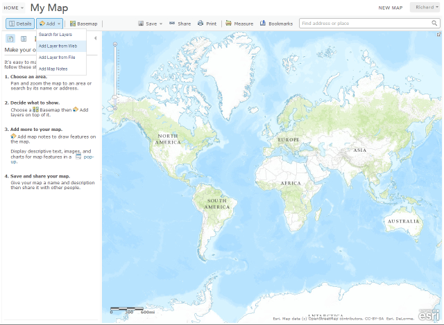
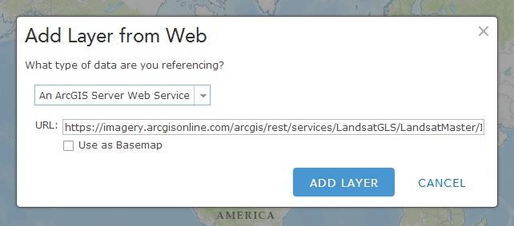
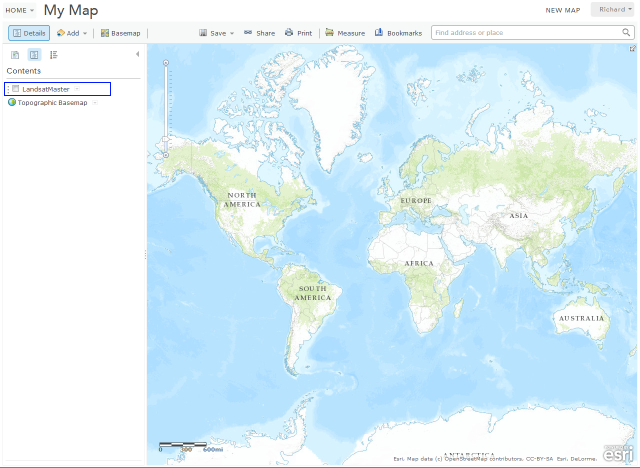
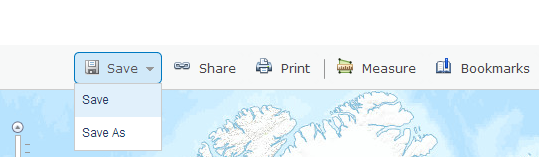
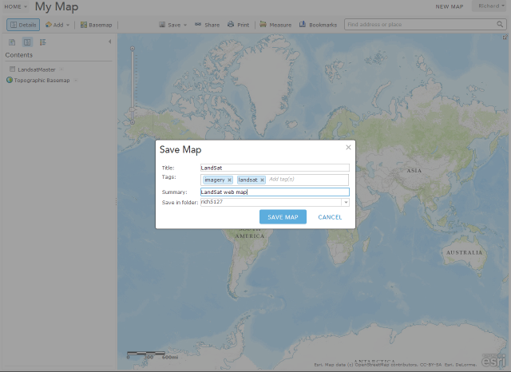
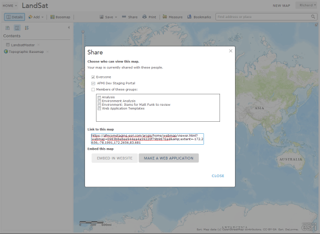
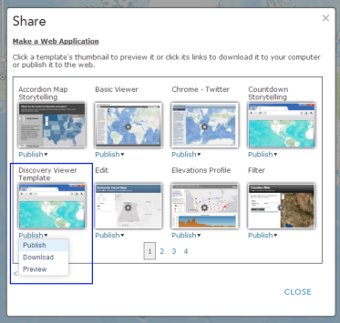
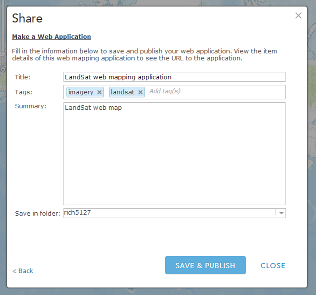
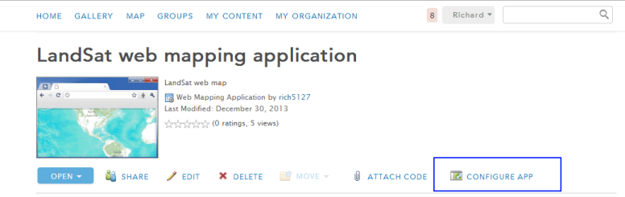
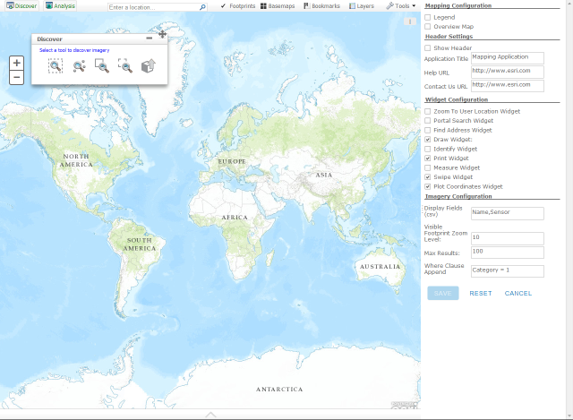

# image-discovery-app-js

####Creating a Web Mapping Application 

* Starting with an empty map in portal click the `Add` button and select `Add Layer from Web`

* Point to an ArcGIS Server Image Service that will be queried on

* Once the layer is added to the map disable the layers visibility in the table of contents

* If desired, repeat the previous steps to add more ArcGIS Server Image Services to the map

* Save The Web Map

* Once the map has been saved click the `Share` button

* Check `Everyone` and click the `Make Web Application` button

* Locate the Discovery Viewer Template and click `Publish` from the dropdown

* Give the Web Application a title and click `Save & Publish`

####Configuring the Web Mapping Application 

* Navigate to the item in Portal and click `Configure App`

* In the right pane you can select which widgets to display, the header to display, and which fields to display in the search results (comma separated)

* Once configuration is complete click `Save`. 
* The applicaiton is now accessible through the Link provided in the Portal item description.

